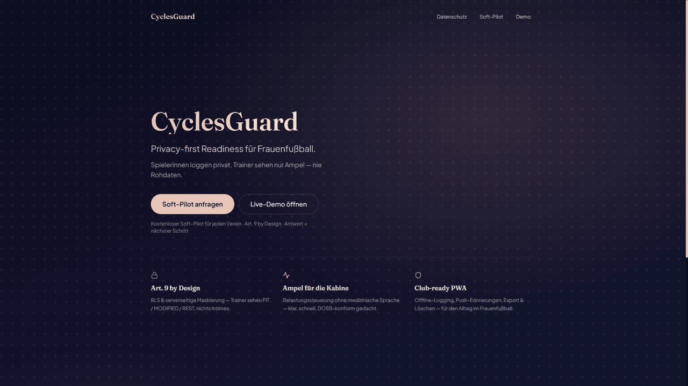

<div align="center">

# CyclesGuard

**Privacy-first Readiness-SaaS für den Frauenfußball.**
Spielerinnen loggen ihr Wohlbefinden & ihren Zyklus in unter 30 Sekunden — Trainer sehen **nie** die Rohdaten, nur eine handlungsfähige Ampel.

[](https://github.com/mdacoding/cyclesguard/actions/workflows/ci.yml)
[](https://cyclesguard.vercel.app)


[Live-Demo](https://cyclesguard.vercel.app) · [Soft-Pilot anfragen](mailto:hello@cyclesguard.de?subject=CyclesGuard%20Soft-Pilot%20anfragen) · [Datenschutz](https://cyclesguard.vercel.app/privacy) · [Roadmap](docs/sprints/00-ROADMAP.md)



</div>

---

## Das Problem

Menstruationszyklen beeinflussen Leistung, Verletzungsrisiko und Regenerationsbedarf messbar — trotzdem wird das Thema im Trainingsalltag von Frauenteams kaum systematisch erfasst. Der Grund ist selten Desinteresse, sondern **Datenschutz**: Niemand will, dass Trainer Zugriff auf intime Gesundheitsdaten haben. Bestehende Tracking-Apps sind entweder Consumer-Zyklus-Apps ohne Team-Anbindung, oder generische Athletik-Tools ohne Sensibilität für Art.-9-Daten.

**CyclesGuard löst genau diese Lücke:** ein Zero-Knowledge-Layer zwischen Spielerin und Trainerstab, der aus privaten Tages-Logs eine einfache, sportlich formulierte Handlungsempfehlung macht — ohne dass eine einzige Rohinformation den Trainer erreicht.

## Wie es funktioniert

```
Spielerin              CyclesGuard (Server)                Trainer / Club-Admin
──────────             ─────────────────────                ────────────────────
Tages-Log      ─────▶  Verschlüsselte Speicherung
(Energie,               + serverseitige Aggregation   ─────▶  Ampel: FIT · MODIFIED
Symptome,                (Row Level Security DENY               REST · NO_DATA
Zyklusphase)             für Trainer-Rolle auf                + kurze Trainingshinweis
                         `cycle_logs`)                        (nie Phase/Symptome/Notizen)
```

Durchgesetzt wird das nicht per Konvention, sondern **technisch**: PostgreSQL Row Level Security verweigert der Trainer-Rolle jeden Lesezugriff auf die Rohtabelle. Die Aggregation läuft ausschließlich serverseitig mit geprüfter Autorisierung — es gibt keinen API-Pfad, über den Rohdaten das Frontend eines Trainers erreichen können.

## Features

| Für | Was |
|-----|-----|
| 🏃 **Spielerin** | <30s Tages-Log, 28-Tage-Historie, Offline/PWA-Sync, Push-Erinnerungen, DSGVO-Export & Account-Löschung |
| 🧑‍🏫 **Trainer** | Team-Ampel (FIT / MODIFIED / REST / NO_DATA), Last-Hinweise, 7-Tage-Trend, Teilen für die Kabine |
| 🏟️ **Club-Admin** | Roster-Invite (CSV-Bulk mit Vorschau), Saison-/Vertragsverwaltung, Adherence-Scorecard — **keine** Gesundheits-Rohdaten |
| 🔒 **Privacy Engineering** | Row Level Security DENY auf `cycle_logs`, serverseitige Maskierung, gehashte Consent-Audit-IPs, Zero-Knowledge-Aggregation |
| 📡 **GPS-Bridge (optional, Pilot+)** | Eigener Spring-Boot-Ingestion-Service mit HMAC-Auth, Outbox-Queue, Datenbereinigung — komplett getrennt von Zyklusdaten |

## Tech Stack

| Layer | Technologie |
|-------|-------------|
| Frontend | Next.js 14 (App Router), TypeScript, Tailwind CSS, Framer Motion |
| PWA / Offline | Serwist Service Worker, IndexedDB Outbox-Sync, Web Push (VAPID) |
| Backend / Auth | Supabase (Postgres, Auth, Row Level Security) |
| Validation | Zod |
| GPS-Ingestion | Spring Boot 3.3, Java 21, Flyway, PostgreSQL |
| Monitoring | Sentry (EU, Health-Payloads serverseitig gestrippt) |
| Hosting | Vercel (`fra1`, EU-Edge), Supabase Frankfurt |
| Testing | `node:test` (Unit), Playwright (E2E), GitHub Actions CI |

## Monorepo

| Pfad | Rolle |
|------|-------|
| [`cyclesguard-frontend/`](cyclesguard-frontend) | Player / Trainer / Club-Admin App (Next.js PWA) |
| [`cyclesguard-ingestion/`](cyclesguard-ingestion) | GPS-Telemetrie-Bridge (Spring Boot, optional ab Pilot) |
| [`docs/`](docs) | Roadmap, Pitch-Pack, Datenschutz-Dokumentation |

## Quick Start (lokal)

```bash
cd cyclesguard-frontend
cp .env.example .env.local        # oder: npm run pitch:setup-env
# Supabase-Keys eintragen — siehe docs/pitch/SUPABASE-SETUP.md
npm install
npm run seed:demo                 # nach den Migrationen auf Supabase
npm run dev
```

Demo-Logins zum Reinklicken: [`docs/pitch/DEMO-ACCOUNTS.md`](docs/pitch/DEMO-ACCOUNTS.md) · Kompletter Ablauf: [`docs/pitch/DEMO-SCRIPT.md`](docs/pitch/DEMO-SCRIPT.md)

## Produktstadien

```
Pitch-Ready   →   Soft-Pilot   →   Paid SaaS
   (jetzt)        nach Club-Zusage    nach Pilot-Erfolg
```

| Stage | Ziel | Gate |
|-------|------|------|
| **Pitch-Ready** | Live-Demo, Datenschutz-Pack, Pilotangebot | ✅ erreicht |
| **Soft-Pilot** | 5–10 freiwillige Spielerinnen, 8–12 Wochen, wöchentliches Feedback | Club-Zusage |
| **Paid SaaS** | Multi-Club, Verträge, Billing, GPS optional | Pilot-Erfolgsmetriken |

Vollständiger Plan: [`docs/sprints/00-ROADMAP.md`](docs/sprints/00-ROADMAP.md) · SaaS-Sicht: [`docs/product/SAAS-PLAN.md`](docs/product/SAAS-PLAN.md)

## Datenschutz & Compliance (non-negotiable)

1. Trainer sehen ausschließlich `FIT | MODIFIED_TRAINING | REST | NO_DATA` (+ Last-Hinweise)
2. Keine Zyklusphase, Symptome oder Freitext-Notizen in Trainer-UI oder Push-Payloads
3. DSGVO Art. 9 Einwilligung, Datenexport (Art. 15/20), Löschung (Art. 17)
4. EU-Hosting durchgängig (Supabase Frankfurt, Vercel `fra1`)
5. Automatisierte Produktions-Checks: `npm run verify:prod` prüft Env, RLS-Status und führt einen Zero-Knowledge-Audit-Test gegen `cycle_logs` aus

Details: [`docs/pitch/DATENSCHUTZ-DOSB-1-PAGER.md`](docs/pitch/DATENSCHUTZ-DOSB-1-PAGER.md) · AVV-Entwurf: [`docs/privacy/AVV-TOM-DRAFT.md`](docs/privacy/AVV-TOM-DRAFT.md)

## Deploy (Pitch-Setup)

1. Dieses Repo auf [Vercel](https://vercel.com) importieren
2. Root Directory: **`cyclesguard-frontend`**
3. Env-Variablen: siehe [`docs/pitch/DEPLOY.md`](docs/pitch/DEPLOY.md)
4. Supabase Auth Site URL + `/auth/callback` setzen
5. Smoke-Test: `npm run pitch:smoke -- https://<deine-url>`

## CI

GitHub Actions ([`.github/workflows/ci.yml`](.github/workflows/ci.yml)): Frontend-Tests + Build (Next.js), Ingestion-Tests (Maven). Läuft auf jedem Push/PR gegen `main`.

## Soft-Pilot anfragen

CyclesGuard sucht ambitionierte Vereine für einen **kostenlosen 8–12-Wochen-Soft-Pilot** (5–10 freiwillige Spielerinnen, kein Stripe, kein GPS-Zwang). Interesse? [hello@cyclesguard.de](mailto:hello@cyclesguard.de) oder direkt über die [Live-Demo](https://cyclesguard.vercel.app/pilot).

---

<div align="center">
<sub>Made with care for female athletes · <a href="https://cyclesguard.vercel.app/impressum">Impressum</a> · <a href="https://cyclesguard.vercel.app/privacy">Datenschutz</a></sub>
</div>
